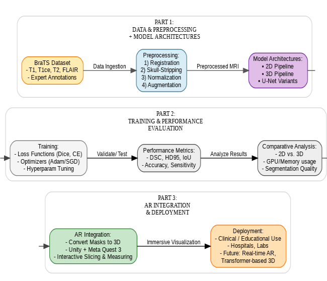
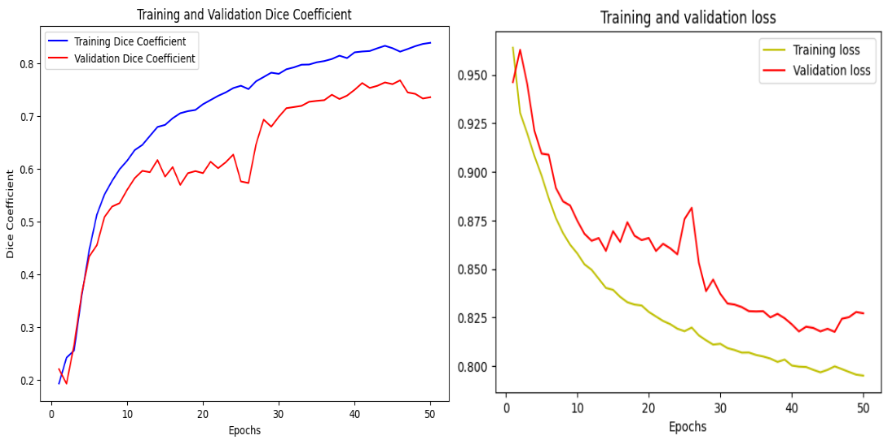
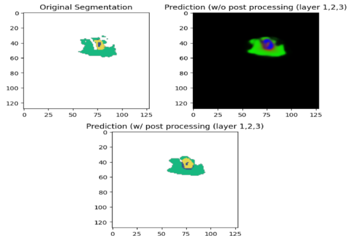
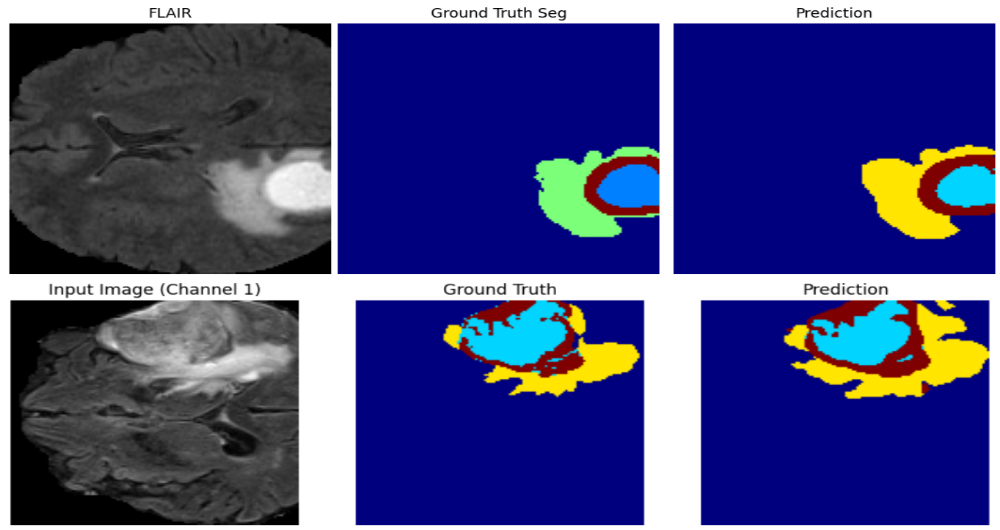

# 3D Brain Tumor Segmentation using U-Net: Integrating Deep Learning and Mixed Reality

[](https://doi.org/10.1109/IMSA65733.2025.11167635)
[](https://doi.org/10.1109/IMSA65733.2025.11167635)
[](https://unity.com/)
[](https://www.meta.com/quest/quest-3/)

> **🏆 Best Graduation Project Award - MSA University 2025**  
> **📝 Published in IEEE IMSA 2025**

## 📋 Overview

Brain tumor segmentation system integrating **2D/3D U-Net architectures** with **Mixed Reality visualization** for Meta Quest 3. Enables clinicians and educators to explore segmented MRI data in 3D using hand gestures and controllers.

## 🥽 Interactive Mixed Reality visualization on Meta Quest 3


**📹 Full Video Demo:** [Watch on YouTube](https://www.youtube.com/watch?v=Yrfx4ss8Wbw)  
*Complete walkthrough of the MR interface and segmentation pipeline*


**Key Features:**
- Real-time 3D tumor visualization in Mixed Reality
- Interactive manipulation (rotation, zooming, annotation)
- Deep learning segmentation integration
- Enhanced spatial understanding for diagnostics

## 🏗️ System Architecture



**Pipeline:**
```
MRI Data → Preprocessing → U-Net Segmentation → 3D Reconstruction → MR Visualization
```

## 📈 Results

## 🔬 Performance Metrics

| Model | Dice Score | Accuracy | HD95 (mm) | Training Time |
|-------|-----------|----------|-----------|---------------|
| 2D U-Net | 51.53% | 94.00% | 34.53 | ~5 min/epoch |
| 3D U-Net | **71.66%** | **98.62%** | **12.17** | ~1 min/epoch |

**Highlights:**
- 20% improvement in Dice score with 3D U-Net
- Superior boundary delineation (HD95: 34.53mm → 12.17mm)
- Better volumetric context capture

### Training Performance


### Segmentation Comparison

**2D U-Net:**



**3D U-Net:**




**Features:**
- Hand gesture and controller support
- 6DoF manipulation (rotate, translate, zoom)
- Annotation and measurement tools
- Session capture functionality
- Multiple visualization modes

## 📊 Technical Details

**Dataset:** BraTS 2020 (FLAIR, T1, T1ce, T2 modalities)

**2D U-Net:**
- Input: 2D MRI slices
- Loss: Dice + Cross-Entropy
- Training: 30 epochs, batch 100
- Hardware: NVIDIA T4

**3D U-Net:**
- Input: 128×128×128 patches
- Loss: Weighted Dice + Focal
- Training: 50 epochs, batch 2
- Hardware: NVIDIA A100

## 🛠️ Tech Stack

**Deep Learning:** PyTorch, TensorFlow, Keras, NumPy, nibabel  
**Mixed Reality:** Unity, Meta Quest SDK, VTK  
**Languages:** Python, C#

## 🎓 Applications

**Educational:**
- Immersive anatomy learning
- Interactive case studies
- Training scenarios

## 📝 Citation

```bibtex
@INPROCEEDINGS{11167635,
  author={Khaled, Amr and Mounir, Ahmed and Taha, Zeinab},
  booktitle={2025 Intelligent Methods, Systems, and Applications​ (IMSA)}, 
  title={3D Brain Tumor Segmentation using U-Net: Integrating Deep Learning and Mixed Reality for Medical Imaging and Education}, 
  year={2025},
  volume={},
  number={},
  pages={577-582},
  keywords={Deep learning;Training;Solid modeling;Image segmentation;Three-dimensional displays;Accuracy;Computational modeling;Mixed reality;Brain tumors;Virtual reality;Brain Tumor Segmentation;2D U-Net;3D U-Net;Deep Learning;Mixed Reality;Medical Imaging},
  doi={10.1109/IMSA65733.2025.11167635}}

```

**Paper:** [DOI: 10.1109/IMSA65733.2025.11167635](https://doi.org/10.1109/IMSA65733.2025.11167635)

## 🏆 Awards

- 🥇 First Place - Best Graduation Projects (MSA University, 2025)
- 🎖️ Graduation Project Recognition (Ultimate Academy, 2025)

## 👥 Contact

**Ahmed Mounir**  
MSA University - Computer Science  
📧 ahmedmounir789@gmail.com  
🔗 [LinkedIn](https://linkedin.com/in/ahmed-mounir682) | [GitHub](https://github.com/Mounir62)

---

⭐ **Star this repository if you find it useful!**
